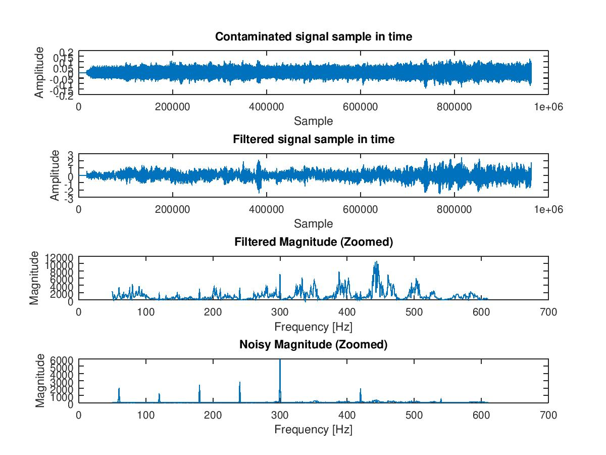

# Sistema de Supresión de Ruido de Red Eléctrica

1. **¿Cuál es la frecuencia de muestreo con que fue tomada la señal?**

Ejecutando:

```bash
./1_detect_fs.m
```

Se determina que es 48 kHz

2. **Utilice la DFT para desplegar el contenido espectral de la señal en su totalidad. Asegúrese que el eje x de los gráficos tenga las unidades apropiadas en frecuencia (Hz).**


Se puede reproducir ejecutando:

```bash
./2_3_4_complete_dft.m
```

3. **Identifique en el espectro las componentes de frecuencia causadas por la l ́ınea de poder de 60Hz, así como sus posibles armónicos. Para ello, realice una ampliación del espectro en la región de interés pero asegúrese que las unidades se mantengan correcta.**


Se puede reproducir ejecutando:

```bash
./2_3_4_complete_dft.m
```

Se pueden notar las armónicas:

1. 60 Hz
2. 120 Hz
3. 180 Hz
4. 240 Hz
5. 300 Hz
6. 360 Hz (aunque no tiene mucha amplitud)
7. 420 Hz

En general, en electrónica de potencia y líneas de distribución de potencia, las tres primeras armónicas impares son las más problemáticas a nivel y usualmente deben ser atacadas para no perjudicar a la red eléctrica.

4. **Presente la Transformada Discreta de Fourier de Corto Plazo para 4 ventanas distintas de mucho menor tamaño. Identifique las mismas componentes parásitas en dichos espectros**


Se puede reproducir ejecutando:

```bash
./2_3_4_complete_dft.m
```

5. **Proponga un sistema IIR que suprima las componentes de ruido de 60Hz y sus armonicos. Presente su funcion de transferencia ası como su ecuacion de diferencias y su diagrama de polos y ceros**

Para el filtrado de armonicos se utilizan los filtros peine, que son filtros de ranura que filtran multiplos de una frecuencia. Uno de los mas populares es el de media movil. Para ello, considere el filtro FIR:

$$
y[n] = \frac{1}{M+1} \sum_{k=0}^{M} x[n-k]
$$

La funcion de transferencia estaria dada por:

$$
H(z) = \frac{1-z^{-(M+1)}}{1-z^{-1}}
$$

Dado que lo requerido es un filtro IIR, el filtro tiene que depender de salidas previas. Para ello, a partir de la función de transferencia anterior:

$$
(1-z^{-1}) Y(z) = (1-z^{-(M+1)}) X(z) 
$$

Transformando al espacio para obtener la ecuación de diferencias:

$$
y[n] - y[n-1] = x[n] - x[n - M - 1]
$$

$$
y[n] = y[n-1] + x[n] - x[n - M - 1]
$$

El valor de M estara dado por el numero de zeros que se desean agregar. Para ello, se debe tomar en cuenta que uno de los ceros esta en el eje real, mientras que en $2\pi$ va a estar la frecuencia de muestreo: $f_s$. Dado que $f_s = 48000$ Hz y la frecuencia fundamental es $f_o = 60$ Hz. Entonces, para ello, el numero M es cuantas veces cabe la frecuencia fundamental en $f_s$,  $M = 48000 / 60 = 800$.


6. **Despliegue su respuesta en frecuencia. Para ello utilice alguna herramienta como `freqz`. Asegurese que el eje x tenga unidades de Hz**


7. **Filtre la se ̃nal contaminada utilizando alguna herramienta como filter. No implemente el filtrado manualmente mediante la convolucion**



8. **Presente conclusiones (cualitativas) sobre el resultado obtenido. Procure compararlo con la señal de referencia. Si el protipo no fue satisfactorio, presente un analisis donde detalle las posibles causas.**
